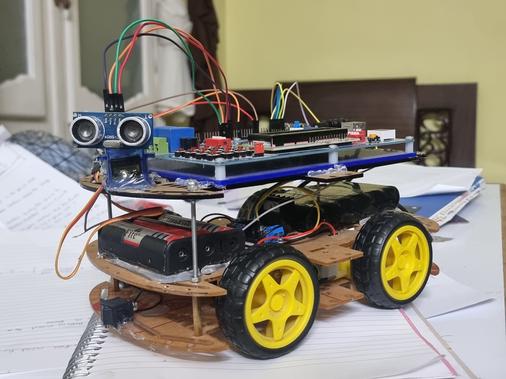

# AMIT Graduation Project

This project aims to implement a self-driving car that can avoid obstacles with very fast response times. The car is built using an ATmega32 microcontroller, ultrasonic sensor, servo motor, and additional components to facilitate autonomous navigation.

---

### Car Image

  

---

### Car Test Animation

  

---

## Project Specifications

1. **Ultrasonic Sensor**: 
   - Mounted on a servo motor, the ultrasonic sensor detects obstacles in the car’s path. 
   - When an obstacle is detected, the car responds quickly by stopping or turning toward an available direction to avoid the obstacle.

2. **L293D Motor Driver**:
   - Controls the direction of the DC motors.
   - Although speed control is not implemented in this project, the L293D enables movement in various directions.

3. **LCD Display**:
   - Displays the car’s current direction, allowing the user to see the car’s immediate navigational decisions.

4. **Servo Motor**:
   - Mounted with the ultrasonic sensor to enable scanning over a 180° range.
   - Guides the car's navigation by helping the ultrasonic sensor cover a wider detection area.

---

## Components

- **Development Kit**: AVR development kit from Fares PCB
- **Microcontroller**: ATmega32
- **Motors**: 4 DC motors (no speed control implemented)
- **Sensors**: Ultrasonic sensor for obstacle detection
- **Servo Motor**: Used to rotate the ultrasonic sensor for scanning

